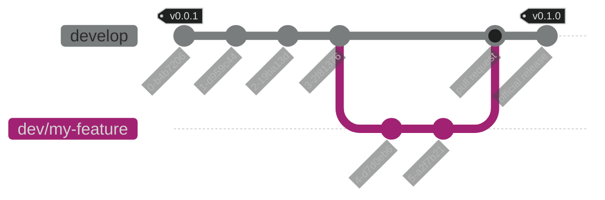

## Development git flow

Development in the Unity Package Example uses a mainline branching scheme with release tagging. All development occurs off of the `develop` branch. Release tags are created off of the `develop` branch via a GitHub Action. See [the release guide](./howto/create-a-release.md) for instructions on how to use the action to publish a new release.

The diagram below shows how the git workflow looks as a new feature is started, worked on and then merged into `develop` with a follow-up minor version release.

### Branch naming

This project uses the following branch naming conventions:

| Branch Pattern | Example | Description |
|----------------|---------|-------------|
| `dev/*`        | `dev/my-new-feature` | the default branch prefix. You should use this for most of the branches you create when working on the project. |
| `exp/*`        | `exp/upgrade-unity-6` | used when experimenting with new features/processes or for other changes that are unlikely to be submitted to the `develop` branch. |
| `fix/[\d+]`    | `fix/123` | is used when working on a fix for an open issue to the project. |

### Pull requests

All changes to the project should be submitted via a pull request. This gives the maintainers of the project a chance to look over the changes to ensure documentation, code quality, etc meet the project standards. It also allows the automated processes in our [continuous integration](./features/continuous-integration.md) pipeline to run.

#### General tips

1. Keep the amount of changes in a single pull request small. This not only allows reviewers to more quickly look over your changes but it also increases the likelyhood of your changes being accepted. If you submit a pull request with 10 different features and fixes, it may not be accepted because 2-3 of those may be in progress with other contributors, or may not fit the project roadmap.
2. The title of your pull request should be short but long enough to describe exactly what is being fixed/changed/added.
3. Use the description of your pull request to expand on your title. Explain the "why" of the pull request and include links to supporting materials, images, diagrams, blog posts, etc.
4. Use in-line comments to draw reviewers to key areas of your changes.

#### Pull request labeling

We use labels to quickly scan through open pull requests and issues. The `labeler` workflow ensures that each pull request has labels attached to it that indicate which areas of the project have been updated.

### Merging a develop only change

Pull requests made to the `develop` branch shouldn't have `release/*` labels, adding them won't do anything.

> Why not create release tags directly off of the `develop` branch?

This is definitely a valid strategy. We prefer to follow a pull request oriented workflow whenever possible as it allows for a natural checkpoint before triggering the next part of a process. Tagging directly off of `develop` wouldn't allow for that.

> Does the `develop` branch cause long delays in shipping smaller releases?

We haven't noticed much delay in getting minor or patch versions released with this model, but it's a risk if maintainers aren't properly keeping up with the repository changes. If a change you've made hasn't been released in a timely manner please do raise an issue and let us know!

## Local environment setup

- Unity 2021.3.22f1 or greater
- VSCode or Rider

### Open the unity-project

1. Open Unity Hub, select "Add Project" and then "Add from disk"
2. In the dialog window, navigate to where you've checked out the noir repository and select the `unity-project` folder.
3. Click "Open Project"
4. You're now all setup to start making changes to the Noir source!
