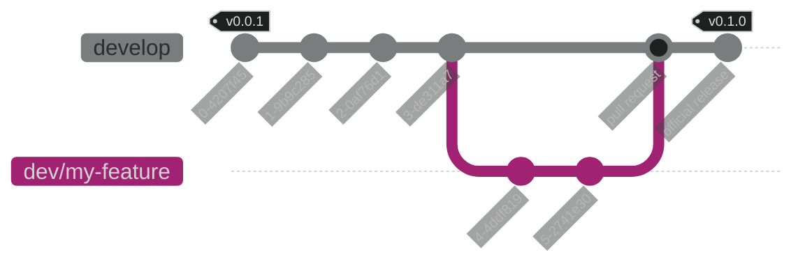

# Developing your package

Package development within Unity is, like a lot of things involving Unity, a
bit of a headache if you've not put time into structuring your project. The
Unity Package Project is configured out of the box to make development as
easy as possible.

## Development git flow

Development in the Unity Package Example uses a mainline branching scheme with
release tagging. All development occurs off of the `develop` branch. Release
tags are created off of the `develop` branch via a GitHub Action. See
[the release guide](./howto/create-a-release.md) for instructions on how to use
the action to publish a new release.

The diagram below shows how the git workflow looks as a new feature is started,
worked on and then merged into `develop` with a follow-up minor version release.

